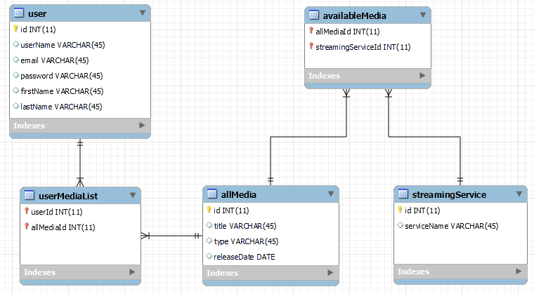
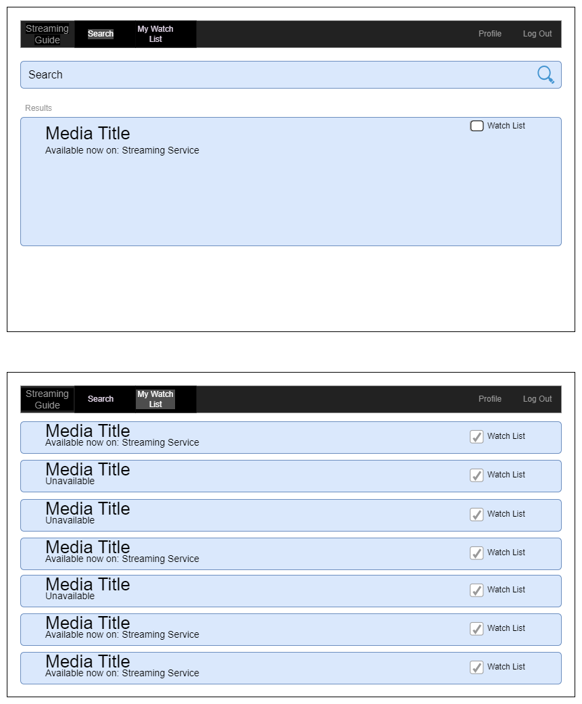
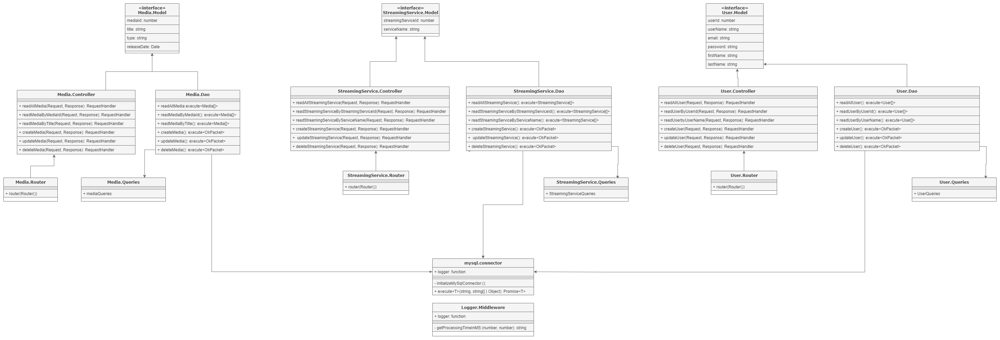

# CST391 Milestone Project
### Goal:
Design 2 web applications that implement a REST API back-end services using Express and NodeJS.  1 app uses the Angular JS Framework and the other uses the React JS Framework.  A product must be supported that includes at least 3 different data types in the MySQL DB and implement CRUD operations. 

## Milestone 3: Complete Working Rest API 2024/1/14
I needed to make 2 tables that worked as intermediaries. The userMediaList has items that the user wants to know about.  It contains the ids as foreign keys from both the allMedia and Users tables.  The availableMedia has items that are currently showing on streamingServices.  It contains the ids as foreign keys from both the allMedia and streamingServices tables.  I was thinking of just joining the availableMedia and userMediaList to get the media that is available that a user wants to know about, but I might consider making 1 more entity called availableMediaOnUserMediaList...or something like that.

I used the same folder structure as the activities suggested.  I created folders for each entity: allMedia, availableMedia, streamingServices, userMediaList, and users.  Each folder contains a controller, dao, model, queries, and routes .ts file.  This produces a MVC design pattern.  

I followed the activity and used a logger middleware. 

I have working APIs for all 5 entities. All CRUD operations are working.   

Adding Angular looks like the next step.  I'm looking forward to it!

## Milestone 2: Refined Project Proposal 2024/1/1 Due 2024/1/14
### Introduce my REST API
The "products" for my app are the Media and Users.  The Media, at this time, consists of: id, title, type (movie or series), and releaseDate.  

The following will explain the API endpoints for Media:  
GET /media/ is for returning a list of all the Media in the database.  
GET /media/:title is for returning a list of the Media in the database with the specific title.  
POST /media/ is for adding new Media to the database.  
PUT /media/:id is for updating the Media with the specific id#.  
DELETE /media/:id is for deleting the Media with the specific id#.

The following will explain the API endpoints for Users:  
GET /users/ is for returning a list of all the Users in the database.  
GET /users/:id is for returning the User in the database with the specific id#.  
POST /users/ is for adding new Users to the database.  
PUT /users/:id is for updating the User with the specific id#.  
DELETE /users/:id is for deleting the User with the specific id#.

## Milestone 1: Project Proposal 2023/12/24 

### Introduction:

I would like to develop an app that is a guide for all of the movies and shows on streaming services.  It should allow users to search for all known movies and shows and also create a wish list for media that is not currently available.  When the media becomes available, the users will be notified if they have it on their wish list along with what streaming service it is available to watch on.  The product is the _media_. 

### Functionality Requirements (User Stories):

- As a user, I want to be able to search for movies and/or shows to find what streaming services currently have them available to watch, so I can watch them.
- As a user, I want to be able to create a list of movies and/or shows, so that I can watch them in the future.
- As a user, I want to be notified about what movies and/or shows are available to watch based on my previously created list, so that I can watch them.

**Nice but not necessary yet:**
- (Maybe someday) As a streaming service, I want to have a list of what movies and/or shows consumers want to watch, so that I can make them available (and I might pay money for that data - unless I already know everything I want to know).
- I want to be able to select the streaming services that I have, so that I'm only notified about media that is available to me.
- As a user, I want to search for media based on the actors who are in it, so that I can watch media with specific actors.
- As a user, I want to be able to mark media as watched, so that I can keep track of what I have seen already.
- As a user, I want to be able to rate media that I've watched based on certain criteria, so that I can keep track of what I like.
- As a user, I want to be notified about media that is similar to other media that I like, so that I can watch media that I enjoy.

### ER Diagram:

### UI Wireframes:

### UML Classes:

### Risks:

I may not have time in this school project to implement a way to gather all of the media from streaming services.  I don't currently know if each streaming service has a public list of all of their media either.  I also, don't have experience in parsing lists of content to get the data that this app would need.  So, I may resort to hard-coding all of the media to get the app functioning first.  Then toward the end of the project, add the functionality to update live media if I have time.
